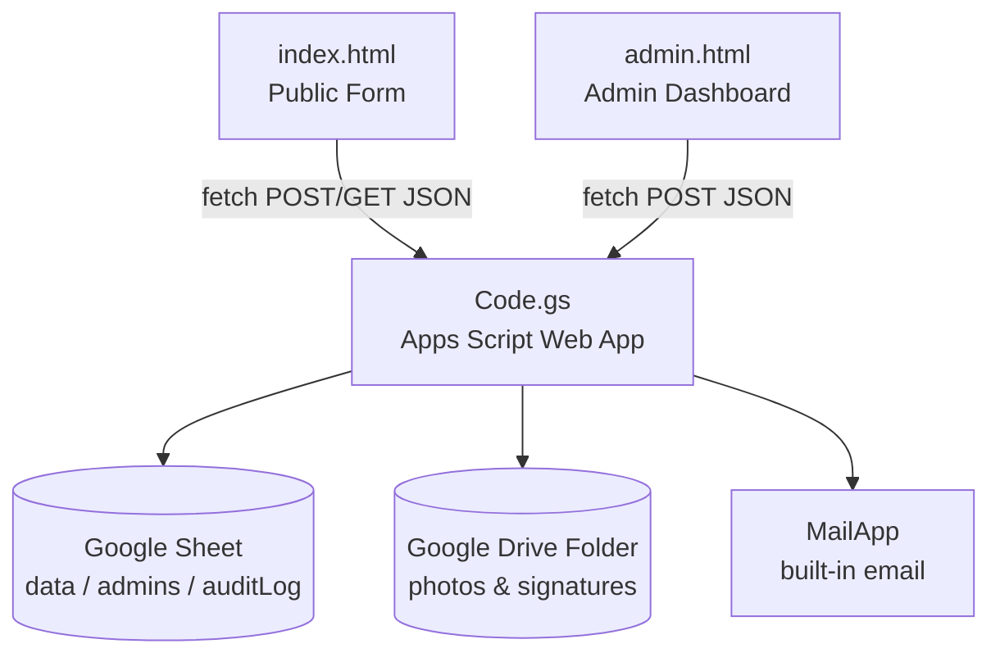
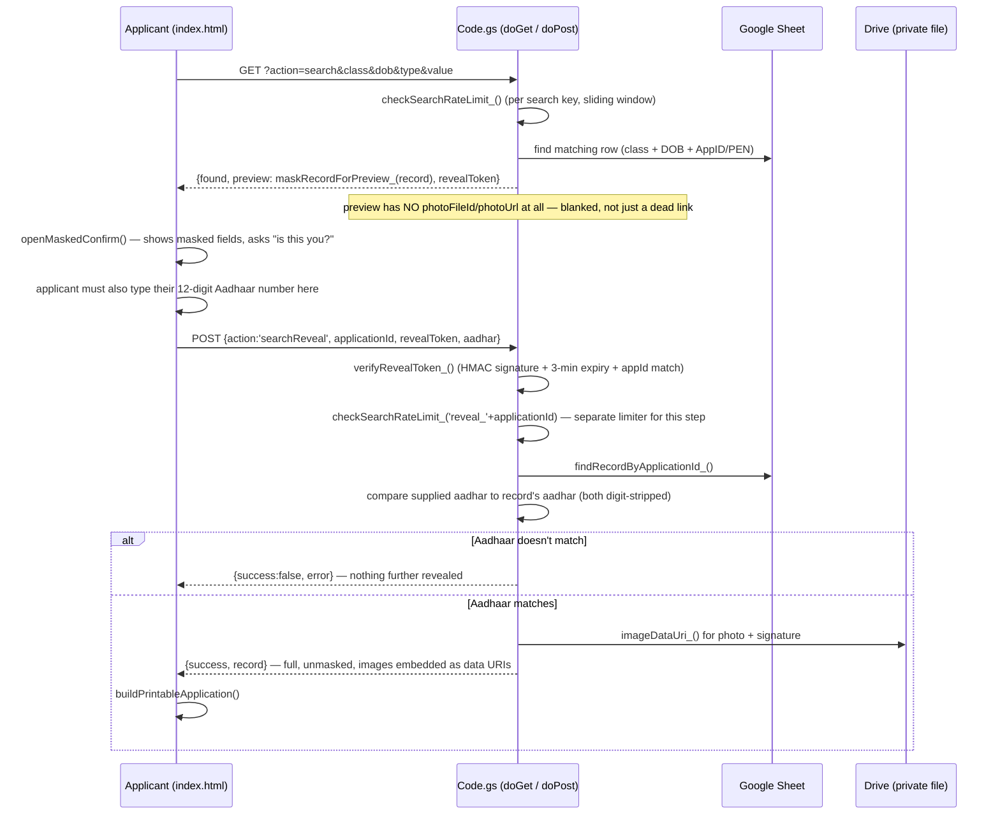
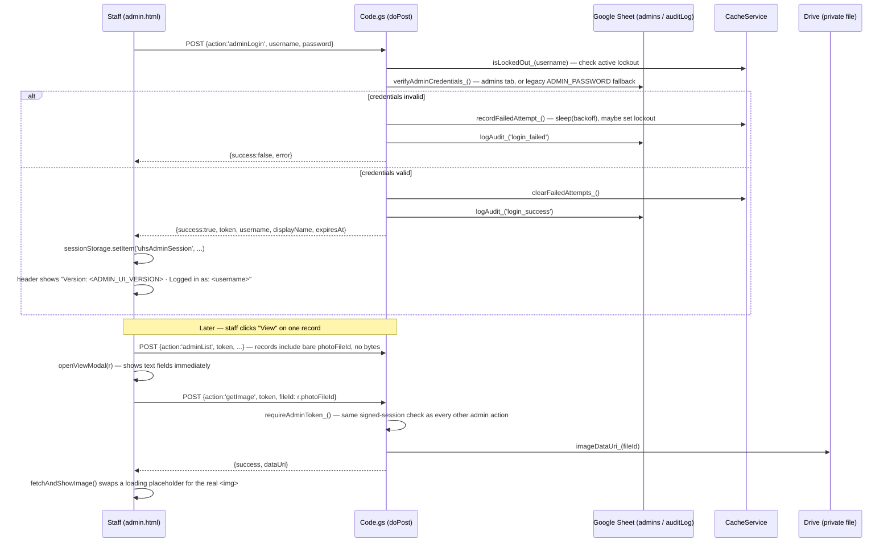

# Architecture

## Overview

The system is a **serverless, three-tier application built entirely on Google's free-tier infrastructure**:



There is no application server, no database server, and no separate hosting — `index.html` and `admin.html` can be hosted anywhere static files can be served (or opened locally / from Google Sites / GitHub Pages), and both talk directly to the Apps Script Web App URL over HTTPS.

---

## Components

### 1. `Code.gs` — the backend

Deployed via **Deploy → New deployment → Web app**, this becomes a single HTTPS endpoint exposing:
- `doGet(e)` — handles the one unauthenticated read action: `?action=search`.
- `doPost(e)` — a router over a JSON body's `action` field, handling everything else.

Apps Script executes as whichever Google account owns the deployment ("Execute as: Me"), which is what gives the script permission to read/write the Sheet and Drive folder without the visitor ever needing a Google account.

### 2. Google Sheet — the database

One Spreadsheet (`SHEET_ID` script property) with up to three tabs, each created automatically on first use:

| Tab | Purpose |
|---|---|
| `data` | One row per application. Columns = `HEADERS` array in `Code.gs`. |
| `admins` | Optional. `username`, `passwordHash` (SHA-256, base64), `displayName`. |
| `auditLog` | Append-only. `timestamp`, `username`, `action`, `detail`. |

**Schema evolution:** every read/write looks up columns by *header name* (`headers.indexOf(key)`), never by fixed position. `getSheet_()` compares the sheet's current header row against the `HEADERS` array and **appends** any missing columns at the end. This means adding a new field to `HEADERS` and redeploying is always safe on an existing, populated sheet — old rows just get a blank value in the new column.

Current `data` schema (`HEADERS` in `Code.gs`):

```
applicationId, submittedAt, updatedAt, admClass, rollNo, stream,
langGroup, subComp1, subComp2, subElec1, subElec2, subElec3, subAddl,
pen, apaar, aadhar, eshiksha, otr,
studentName, dob, gender, category, religion,
motherName, fatherName, aadharOwner, guardianAadhar, mobile, email,
address, pincode,
distance, cwsn, income, bloodGroup, height, weight,
prevUdise,
bankAccount, ifsc, bankName, accHolder, accRelation,
photoFileId, signatureFileId
```

`photoFileId`/`signatureFileId` hold a private Drive **file ID**, not a URL — see the dedicated section below. Rows created before this scheme was introduced may instead still have their original data sitting under legacy `photoUrl`/`signatureUrl` columns (never removed from the sheet, just no longer part of `HEADERS`); `resolveFileId_()` transparently falls back to extracting a usable file ID out of those old links so nothing breaks.

`rollNo` is a plain, optional text field — the school's own roll number for the applicant, if one has already been assigned. It's stored and displayed exactly like any other text field (no special validation, no uniqueness check); nothing else in the request/response flow treats it differently from, say, `studentName`. On a sheet that predates this field, it's simply appended as a new blank column on first write after upgrading, per the schema-evolution behavior described above — no manual migration needed.

**`subComp1`, `subComp2`, `subElec1`, `subElec2`, `subElec3`, `subAddl`** (Class XI/XII only) are still plain text columns in the sheet — nothing changed here on the backend or schema side. What changed is entirely client-side: `index.html` now populates these as dependent dropdowns (sourced from a hard-coded `SUBJECT_DATA` table matching BSEB's official Arts/Science/Commerce subject-code sheets) instead of free-text inputs, and submits a formatted string like `"Hindi (306)"` rather than whatever the applicant typed. The backend just stores and echoes back whatever string it receives, same as always — it has no awareness of streams, codes, or the selection rules; all of that lives in `index.html`'s `SUBJECT_DATA` / `refreshSubjectDropdowns()`. See "Class XI/XII subject dropdowns" below for how the dependent selection and mutual-exclusion logic works, and its one caveat for applications submitted before this change.

> **Note on removed fields:** this schema previously also included `deviceInfo`, `geoLocationName`, and `geoLocationLink` (browser-reported device info and consent-based location logging). Both were removed by request. Rows submitted while those fields were active keep whatever data they already have sitting under those old column headers — nothing retroactive is erased — but no new submission writes anything into them, and the owner notification email no longer mentions either.

### 3. Google Drive — file storage (private)

One folder (`DRIVE_FOLDER_ID` script property) receives every uploaded photo and signature as a separate file, named `<applicationId>_photo.<ext>` / `<applicationId>_signature.<ext>`. **Files are never given public sharing.** They stay private to the account that owns the deployment, which is what runs the script — so the script can always read a file's bytes via `DriveApp.getFileById(id).getBlob()` regardless of its sharing setting, while nobody else can reach it directly. See [Photo/signature storage & access model](#photosignature-storage--access-model) below for how bytes actually get to a browser without ever being a linkable URL.

### 4. `MailApp` — email

Apps Script's built-in mail service, used for two independent notification paths (see [Email notifications](#email-notifications) below). No SMTP credentials or third-party service required; sending quota is whatever the owner's Google account allows per day.

### 5. `index.html` / `admin.html` — the frontend

Plain HTML/CSS/vanilla JS, single files, no build step. Both hard-code the deployed Web App URL in a `CONFIG.WEB_APP_URL` constant and talk to it via `fetch`.

### 6. `hash-generator.html` — optional offline utility

Not part of the live request flow at all — doesn't talk to `Code.gs`, doesn't need `CONFIG.WEB_APP_URL`, can be opened with no network connection. Exists purely to produce `admins`-sheet-ready rows (username, SHA-256 password hash, display name) for setting up per-user admin logins, using the browser's built-in `crypto.subtle.digest('SHA-256', ...)` — the exact same algorithm as `hashPassword_()` in `Code.gs` — so a password never has to be typed into the Apps Script editor at all. See `SETUP_GUIDE.md` step 9.

---

## Photo/signature storage & access model

Photos and signatures are stored as **private** Drive files — never publicly shared. There is no URL anywhere in this system that, by itself, lets someone view an applicant's photo or signature. Instead, bytes are only ever handed out in one of two ways, both gated on the requester already having proven they're entitled to that specific file:

1. **Embedded inline**, as a base64 data URI (`data:image/jpeg;base64,...`), inside a response the server was already about to send to someone who just proved entitlement in that same request — a successful submission, a matching Aadhaar+mobile edit-lookup, or a confirmed search reveal. The browser drops this straight into an ``; no second request, no separate URL to leak.
2. **Fetched lazily by an authenticated admin**, one file at a time, via the `getImage` action — called only when staff click "View" on a specific record, never bundled into the paginated list or the CSV export (which would mean shipping every row's images at once).

```mermaid
sequenceDiagram
    participant U as Applicant's browser
    participant W as Code.gs
    participant D as Drive (private file)

    Note over U,W: Submitting (new upload)
    U->>W: photo = data:image/jpeg;base64,... (already compressed client-side)
    W->>D: createFile(blob) — NOT publicly shared
    D-->>W: fileId
    W->>W: photoDataUri = body.photo (no extra Drive read — client already has the bytes)
    W-->>U: {photoFileId, photoDataUri}

    Note over U,W: Editing later (photo untouched)
    U->>W: photo = <bare fileId string, not new bytes>
    W->>W: saveImage_() recognizes it's an existing fileId — reuse, no re-upload
    W->>D: getBlob() — only now does it actually need to read the file back
    D-->>W: bytes
    W-->>U: {photoFileId, photoDataUri} — freshly re-encoded for display
```

Each new upload is stored under its own field key (`photoFileId`, `signatureFileId`) rather than a URL. Every row-building function that returns a record to a browser — `handleSubmit_`, `handleLoadForEdit_`, `handleSearchReveal_` — calls `resolveFileId_()` (falls back to extracting a file ID out of an old public-link column for pre-existing applications) and `imageDataUri_()` (reads the file and base64-encodes it) before responding. `maskRecordForPreview_()` blanks both the current and legacy fields, so the unauthenticated search-preview step never sees a file ID at all, not just a blocked URL.

On the frontend, `index.html` deliberately tracks **two separate values** per image: the value that gets *resubmitted* (`photoDataUrl`/`sigDataUrl` — either freshly-compressed base64 on a new upload, or the existing bare fileId if untouched) and the value that gets *displayed* (`photoDisplayUri`/`sigDisplayUri` — always an actual data URI). Collapsing these into one variable was an early mistake caught during implementation: on the edit path, the resubmission value is a bare fileId string, which is not a valid `` — showing it directly would render a broken image icon in the pre-submit preview modal.

**A note on scope:** this only governs how files behave going forward. Any photo/signature uploaded *before* this model was introduced already had its file publicly shared at creation time; that sharing setting is not automatically revoked. Old applications keep working (viewed, edited, downloaded) via the legacy-URL fallback in `resolveFileId_()`, and editing one upgrades its row to the new private-storage fields — but the *original* file, if never touched again, remains exactly as publicly linkable as it always was. Closing that fully requires a one-time script pass to re-lock existing files (`setSharing(DriveApp.Access.PRIVATE, ...)` on each), which is not included by default — see `SETUP_GUIDE.md` if you want to run one.

**The same gap applies to `importLegacyData_()`** — a direct spreadsheet-to-spreadsheet copy tool for migrating from an older, differently-structured version of this system (see `SETUP_GUIDE.md`). It has no awareness of photos/signatures by default; a naive mapping that just copies an old sheet's photo/signature URL column as text would leave that image exactly as exposed as it always was, since copying a link doesn't change the underlying file's sharing. `migrateLegacyImage_()` exists specifically to avoid that: given an old URL or bare file ID (mapped under the special `photoUrl`/`signatureUrl` `COLUMN_MAP` keys, not the current `photoFileId`/`signatureFileId` headers), it reads that file's bytes and saves a **fresh copy** into this deployment's own `DRIVE_FOLDER_ID`, with no sharing set — same as any file `saveImage_()` creates. The original old file is left untouched either way; only the new copy is private, which is what makes a migrated application's images genuinely private rather than just pointing at a still-exposed original elsewhere on Drive. A failed copy (bad link, inaccessible file) leaves that one field blank and is logged individually, rather than aborting the rest of the import.

---

## Request flow / sequence diagrams

### Submitting a new application

```mermaid
sequenceDiagram
    participant U as Applicant (index.html)
    participant W as Code.gs (doPost)
    participant S as Google Sheet
    participant D as Google Drive
    participant M as MailApp

    U->>U: validateForm(), collectFormData()
    U->>W: POST {action:'submit', ...fields, photo, signature}
    W->>W: LockService.getScriptLock() (serialize writes)
    W->>S: check for duplicate Aadhaar
    W->>D: saveImage_(photo), saveImage_(signature) — files created PRIVATE
    W->>S: appendRow(...) with genAppId_()
    W->>M: sendApplicationEmail_() — only if applicant gave an email; App ID only
    W->>M: sendOwnerNotificationEmail_() — always (serial no., App ID, name, class)
    W-->>U: {success, applicationId, photoFileId, signatureFileId, photoDataUri, signatureDataUri}
    U->>U: show success modal + printable download (uses the embedded data URIs)
```

### Editing an existing application

Same `submit` action, with `isEdit: true` and `applicationId` set. The applicant must first pass through **`loadForEdit`** (Aadhaar + mobile match, rate-limited) to retrieve their record into the form before this happens — that response embeds `photoDataUri`/`signatureDataUri` for display, and `photoFileId`/`signatureFileId` for resubmission if the file isn't replaced. `handleSubmit_` then updates the matching row in place (`setValues` on the existing row) instead of appending a new one, and `sendOwnerNotificationEmail_` fires again with `isEdit: true`.

### Public search → masked preview → reveal



The reveal token is a short-lived, HMAC-signed value scoped to one specific `applicationId` — it cannot be reused for a different application, and expires in `REVEAL_TOKEN_TTL_MINUTES` (default 3 minutes).

**Aadhaar as a second factor at reveal time:** the fields used to reach the masked-preview screen (class + DOB + Application ID or PEN) are workable as a lookup key, but none of them are secret in a strong sense — a classmate or relative could plausibly know all four. Requiring the applicant's own Aadhaar number at the actual reveal step raises the bar meaningfully, since it's a 12-digit number essentially only the applicant/family would have. This check is rate-limited separately from the initial search (`reveal_<applicationId>` as its own `checkSearchRateLimit_` key), so a valid, unexpired reveal token can't be used to brute-force the Aadhaar number by trying many guesses.

### Admin login, session, and viewing a photo/signature



Every admin action (`adminList`, `adminExport`, `adminDelete`, `adminUpdate`, `getImage`) sends the `token` instead of the password; `requireAdminToken_()` verifies its HMAC signature and expiry (`verifyToken_`) before proceeding. The token is stored in `sessionStorage` (cleared when the tab closes), never `localStorage`. `getImage` fetches strictly one file per call — the dashboard's record list and CSV export intentionally never carry image bytes in bulk.

**`adminUpdate`** (`admin.html`'s "संपादित करें / Edit" button) lets any logged-in admin correct a student's data directly — a typo'd mobile number, a misspelled name, a wrong class — without the applicant needing to go through the public Aadhaar+mobile edit flow at all. It's a deliberately separate, much simpler path from `handleSubmit_`: the edit modal is just one plain text input per field (the same set `fieldLabels` already shows in the View modal), pre-filled with the current value; there's no class/stream-dependent subject dropdown logic, and no re-validation beyond what `handleAdminUpdate_` itself enforces (date normalization for `dob`, and always refusing to write `applicationId`/`submittedAt` through `fields`). `updatedAt` is stamped automatically, and the action is logged to `auditLog` the same way a delete or export is. The plain-field part of this is intentionally *not* gated to the `"admin"` username the way export is — every admin account can use it, same as View and Delete.

**Photo/signature replacement, within the same edit modal, is the one part of `adminUpdate` that IS gated to `"admin"` specifically** — same restriction pattern as CSV export. `admin.html` only renders the two file-upload inputs at all when `canExport()` is true for the current session; every other admin account sees just the plain-field table, nothing about images. Each upload is compressed client-side to the exact same size targets `index.html` uses for a fresh submission (`adminProcessImage()`, a direct port of `processImage()`), then sent as a base64 data URL alongside `fields`. Server-side, `handleAdminUpdate_` only acts on `body.photo`/`body.signature` if `auth.username` is `"admin"` — for anyone else, these are silently ignored exactly like a forged `fields.photoFileId` attempt would be, so the UI gate isn't the actual boundary, the server check is. A successful replacement runs through the ordinary `saveImage_()` path (a fresh, private file, same as any new submission) and is echoed back in the response as `photoFileId`/`signatureFileId` so the dashboard's in-memory copy of that row updates immediately, without needing a full page refresh. The previous file is left in Drive, not deleted — same "no cleanup of superseded files" behavior as the rest of this project.

---

## Security model

| Concern | Mechanism |
|---|---|
| Admin password reuse across requests | Signed session token (HMAC-SHA256) replaces the password after login; `TOKEN_TTL_MINUTES` (default 60) |
| Brute-forcing admin login | Per-username lockout after `MAX_LOGIN_ATTEMPTS` (default 5) for `LOGIN_LOCKOUT_MINUTES` (default 15); growing `Utilities.sleep()` delay per failed attempt |
| Brute-forcing the public search / edit-lookup | `checkSearchRateLimit_()` — sliding window counter per search key via `CacheService`, `SEARCH_MAX_ATTEMPTS_PER_KEY` per `SEARCH_WINDOW_MINUTES` |
| Someone who correctly guesses/knows class+DOB+ID/PEN getting the full record too easily | The reveal step additionally requires the applicant's own 12-digit Aadhaar number, checked server-side against the record — a much harder thing to guess than the initial lookup fields, and rate-limited on its own key (`reveal_<applicationId>`) separately from the initial search |
| Leaking sensitive fields to an unauthenticated searcher | `maskRecordForPreview_()` strips/masks Aadhaar, guardian Aadhaar, mobile, bank account, IFSC, and blanks `photoFileId`/`signatureFileId` (and the legacy `photoUrl`/`signatureUrl` columns) until a reveal token is exchanged |
| Replaying or forging a reveal/session token | Both tokens are `base64(payload).hmac(payload)`; the HMAC secret (`ADMIN_TOKEN_SECRET`) is generated once with `Utilities.getUuid()` and stored in Script Properties, never hard-coded |
| Concurrent writes corrupting data | `LockService.getScriptLock()` around the submit and delete handlers |
| Duplicate applications | Aadhaar uniqueness check in `handleSubmit_`, with an edit path offered instead of a hard block |
| Deleting the wrong row after data has shifted | `handleAdminDelete_` re-checks the row's `applicationId` against what the client expects before deleting |
| An admin correcting data accidentally touching identity/file fields | `handleAdminUpdate_` silently ignores any attempt to write `applicationId` or `submittedAt` through `fields` (and `photoFileId`/`signatureFileId` the same way for anyone who isn't `"admin"`) — only other column names are accepted |
| Photo/signature replacement restricted to one account | `handleAdminUpdate_` only acts on the optional `photo`/`signature` inputs if `auth.username` (case-insensitive) is literally `"admin"` — every other admin account has them silently ignored. `admin.html` also hides the upload fields entirely for non-`"admin"` sessions, same UI-convenience-not-the-boundary pattern as CSV export |
| Accountability for admin actions | Append-only `auditLog` tab: every login, failed login, export, and delete is recorded with timestamp + username |
| Export restricted to one account | `handleAdminExport_` checks `auth.username` (case-insensitive) against the literal string `"admin"` and refuses anyone else, server-side — `admin.html` also hides the Export button for non-`"admin"` sessions, but that's a UI convenience, not the actual boundary |
| Image upload abuse | `saveImage_()` only accepts `image/jpeg`, `image/png`, `image/webp` data URLs; anything else is rejected with a field-level error, not silently dropped |

### What the system deliberately does *not* do

- **Does not** attempt to identify which Google account a visitor is logged into in their browser. There is no supported, consented API for this; the undocumented approaches that used to expose it were privacy leaks, not features.
- **Does not** collect any browser-reported device info or geolocation. Both were present in an earlier version of this system and have since been removed by request — see the note under the schema listing above.

---

## Email notifications

Two independent notification paths fire from `handleSubmit_`, wrapped in their own `try/catch` so a mail failure never fails the submission itself:

1. **Applicant confirmation** (`sendApplicationEmail_`) — fires only if `body.email` was filled in and passes a basic regex check. Fires on both a new submission and an edit. Content mirrors the owner notification exactly: serial no., Application ID, student name, class, and roll no.
2. **Owner/staff notification** (`sendOwnerNotificationEmail_`) — fires unconditionally on every submission and every edit, regardless of whether the applicant supplied an email. Recipient is `OWNER_NOTIFY_EMAIL` (Script Property) if set, otherwise the Google account that owns the deployment (`Session.getEffectiveUser().getEmail()`). Includes a running serial number, Application ID, student name, class, and roll no.

Both functions take the same `serialNo` value — computed once in `handleSubmit_` right after the row is written/updated — so if both emails fire for the same submission, they show the identical serial number.

`SMS_ENABLED` gates a third, currently-disabled path (`sendSmsNotification_`) with a commented example for a provider like MSG91; enabling it requires supplying your own API key/gateway.

---

## Class XI/XII subject dropdowns

For Class XI/XII, `index.html` builds six dependent `<select>` dropdowns from a hard-coded `SUBJECT_DATA` table (one block per stream: `Arts`, `Science`, `Commerce`), transcribed directly from BSEB's own "Subject details with their numerical codes" sheets. Each entry is a `[subjectName, code]` pair, grouped into `comp1`, `comp2`, `elective`, and `additional` lists per stream.

**Why codes aren't consistent across groups within a stream:** a subject that appears in more than one group doesn't necessarily keep the same code. Within Science, for example, Urdu is code `107` under Compulsory Group-2 but `126` under Additional — different slots, different codes, same board rule sheet. Subjects that are stream-specific (Physics, Business Studies, etc.) that appear in both the Elective and Additional lists DO keep the same code in both places. Because of this, every "has this subject already been picked elsewhere" check in the code compares by **subject name only** (via `subjectNameOf()`, which strips the trailing `" (code)"`), never by the full stored string — comparing full strings would miss a same-subject conflict whenever the two groups use different codes for it.

**Selection rules enforced automatically, matching the board's own instructions:**
- Compulsory Group-2 excludes whatever was picked in Group-1 (the sheet's own header says as much: "any one subject, which is not selected under Compulsory Subject Group-1").
- The three Elective dropdowns mutually exclude each other's current selection — picking Physics in Elective-1 removes it from Elective-2 and Elective-3's option lists.
- The optional Additional dropdown excludes anything already selected across all five of the above (comp1 + comp2 + all three electives), matching the sheet's instruction that it must be "not selected under compulsory subject group-1 or compulsory subject group-2 or elective subject group."

All six dropdowns are rebuilt together by `refreshSubjectDropdowns()` on any change to the stream or to any one of the six fields, so every dropdown's exclusion list always reflects the others' latest state. `rebuildSubjectSelect()` preserves a dropdown's current selection across a rebuild only if it's still a valid (non-excluded) option afterward — otherwise it resets to blank rather than silently leaving a now-conflicting value selected.

**What's stored:** the submitted value is the full `"SubjectName (Code)"` string (e.g. `"Hindi (306)"`) — this is still just plain text as far as `Code.gs` and the sheet are concerned (see the schema note above); the backend has no special awareness of this format, it's purely a frontend convention.

**One real caveat for this project's existing applications:** anything submitted before this change used free-text subject inputs (e.g. a plain `"Hindi"`, or a typo, or a different spelling entirely), not the `"Name (Code)"` format. When such an application is loaded for editing, those six fields will come up blank in the new dropdowns rather than pre-filled, since nothing in the old free text matches a current `<option>` value — the applicant (or staff, editing on their behalf) simply re-selects the subjects through the dropdown, same as filling them in fresh. Nothing is lost from the sheet itself; the old value stays visible in the admin dashboard and CSV export exactly as submitted, this only affects whether the edit form pre-populates those six fields.

---

## Extending the schema

To add a new form field:
1. Add the field's key to `HEADERS` in `Code.gs` (existing sheets will get the new column appended automatically on next write).
2. Add the corresponding input to `index.html` and include its key in the `fieldLabels` object there (used for the preview/print/printable views).
3. Add the same key to `fieldLabels` in `admin.html` if staff should see it in the record-detail modal.
4. No changes needed to `handleSubmit_`'s row-building logic — it already falls through to `body[key]` for any header it doesn't specifically special-case.
